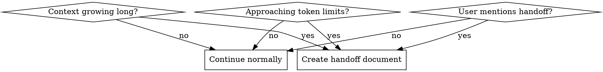

# Handoff

## Overview

创建交接文档，让下一个 AI Agent 在新会话中快速理解现状并继续工作。这是应对上下文限制的标准做法。

## When to Use

**触发条件：**
- 对话轮次超过 50-100 轮
- 系统提示 context compression 正在发生
- 用户明确提到"交接"、"新会话"、"context too long"
- 复杂任务的中途，预期还需要大量对话

## Quick Reference

| 时机 | 动作 |
|------|------|
| 上下文过长 | 使用 `/handoff` 命令 |
| 用户主动要求 | 使用 `/handoff` 命令 |
| 需要保存当前状态 | 使用 `/handoff` 命令 |

## Structure

交接文档包含以下部分：

1. **当前任务目标** - 要解决的问题、预期产出
2. **当前进展** - 已完成的工作（用 ✅ 标记）
3. **关键上下文** - 项目结构、配置、已解决的问题
4. **关键发现** - 重要结论、注意事项
5. **未完成事项** - 按优先级排序的待办
6. **建议接手路径** - 第一步做什么、查看什么文件、运行什么命令
7. **风险与注意事项** - 容易混淆的点、不建议的方向
8. **下一位 Agent 的第一步建议** - 具体的起始动作

## Key Principles

- **这是给 AI 看的**，不是给用户的总结
- **信息具体化** - 使用文件路径、类名、命令，不要说"相关代码"
- **可执行优先** - 保留能直接继续工作的信息
- **标注优先级** - 高优先级先做，低优先级后做
- **记录决策** - 已做出的关键决定、已验证的方案

## Example

参见：[/home/qiuyangwang/prompts/handoff.md](/home/qiuyangwang/prompts/handoff.md)

## Usage

1. 运行 `/handoff` 命令
2. 选择保存位置
3. 命令会自动生成结构化的交接文档
4. 在新会话中，先读取交接文档再开始工作