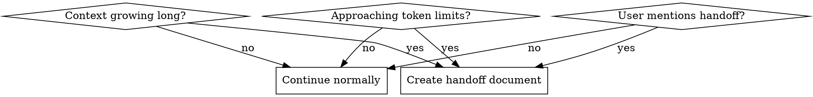
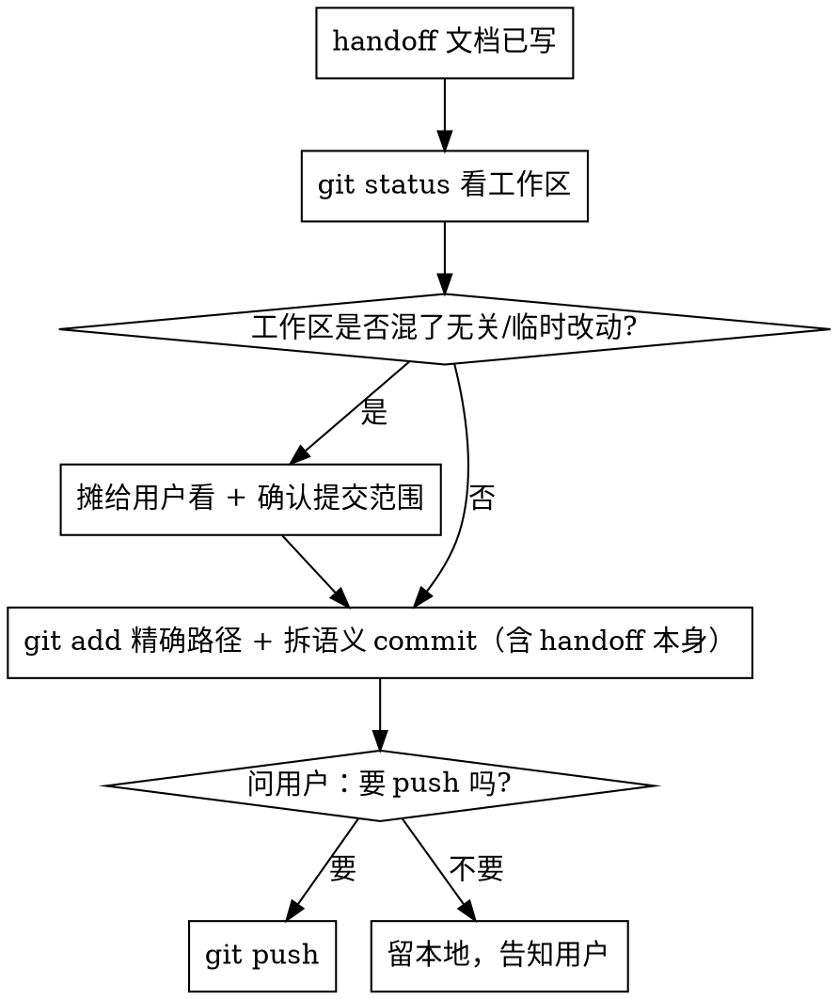

# Handoff

## Overview

创建交接文档，让下一个 AI Agent 在新会话中快速理解现状并继续工作。这是应对上下文限制的标准做法。

## When to Use

**触发条件：**
- 对话轮次超过 50-100 轮
- 系统提示 context compression 正在发生
- 用户明确提到"交接"、"新会话"、"context too long"
- 复杂任务的中途，预期还需要大量对话

## Quick Reference

| 时机 | 动作 |
|------|------|
| 上下文过长 | 使用 `/handoff` 命令 |
| 用户主动要求 | 使用 `/handoff` 命令 |
| 需要保存当前状态 | 使用 `/handoff` 命令 |

## Structure

交接文档包含以下部分：

1. **当前任务目标** - 要解决的问题、预期产出
2. **当前进展** - 已完成的工作（用 ✅ 标记）
3. **关键上下文** - 项目结构、配置、已解决的问题
4. **关键发现** - 重要结论、注意事项
5. **未完成事项** - 按优先级排序的待办
6. **建议接手路径** - 第一步做什么、查看什么文件、运行什么命令
7. **风险与注意事项** - 容易混淆的点、不建议的方向
8. **下一位 Agent 的第一步建议** - 具体的起始动作

## Commit & Push 工作成果（写完文档后必做）

写交接文档只是「记录」状态；交接的另一半是**让状态真正落地到 git**——否则下一个 Agent 在新会话 `git status` 看到的是一堆未提交散改动，handoff 描述的「已完成」与工作区对不上。所以**写完 handoff 后，把本会话的工作 commit 掉，再问用户要不要 push**。

### 流程

### 规则（踩过坑总结）

- **commit 默认做，push 必须问**。commit 是本地、可改可撤；push 是对外、难撤销——push 前一定经用户确认（符合「对外操作先确认」原则）。
- **绝不 `git add -A` / `git add .`**。用 `git add <精确路径>` 只加本会话真正动过的文件。工作区常混入临时产物（侦察脚本、复现脚本、本地报告、截图）和别人未提交的活儿——一把梭会把这些误提进历史，难 review、难 revert。
- **工作区混了无关改动时，先摊给用户看再定范围**：`git status --short` 列全量，区分「本会话产出 / 别人遗留 / 临时产物」，让用户选提交范围；别替用户决定打包别人的活儿。
- **拆语义 commit**：本会话修复一个 commit、文档归档一个、别人遗留的工程改动各自一个——单独可 revert，message 用中文说清意图。
- **handoff 文档本身也要 commit**（很容易漏——它是最后生成的，常被落在工作区）。
- **commit message 结尾按项目规范**（如本仓库 `Co-Authored-By`），并遵守分支模型（如「commit 先进 dev，feature 完成再提 PR」）；直接 push 主干/绕过 PR 流程时，向用户点明。
- **改了核心代码先验证再 commit**：跑该项目的测试/lint/导入检查（本仓库还有「改 tools/builtins/subagents/agents 后跑两裸导入」铁律），别把红的状态 commit 进去。

## Key Principles

- **这是给 AI 看的**，不是给用户的总结
- **信息具体化** - 使用文件路径、类名、命令，不要说"相关代码"
- **可执行优先** - 保留能直接继续工作的信息
- **标注优先级** - 高优先级先做，低优先级后做
- **记录决策** - 已做出的关键决定、已验证的方案
- **状态落地** - 写完文档后 commit 本会话工作（含 handoff 本身），push 前问用户

## Example

参见：[/home/qiuyangwang/prompts/handoff.md](/home/qiuyangwang/prompts/handoff.md)

## Usage

1. 运行 `/handoff` 命令
2. 选择保存位置，生成结构化交接文档
3. **commit 本会话工作**（含 handoff 文档本身）——见 §Commit & Push：`git status` 看全貌 → 混了无关/临时改动则先与用户确认范围 → `git add` 精确路径 + 拆语义 commit
4. **问用户要不要 push**（push 是对外操作，不自动做）
5. 在新会话中，先读取交接文档再开始工作