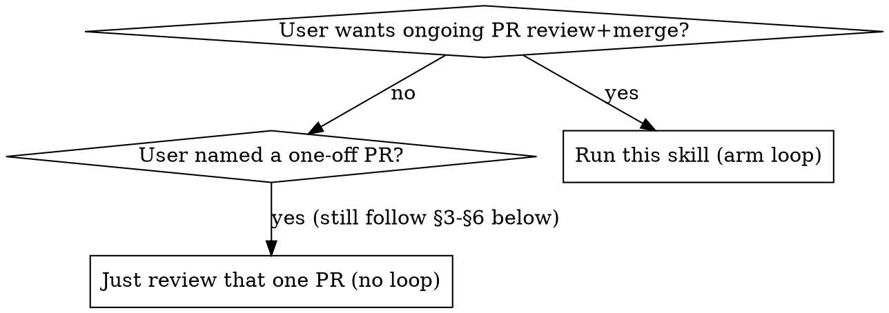
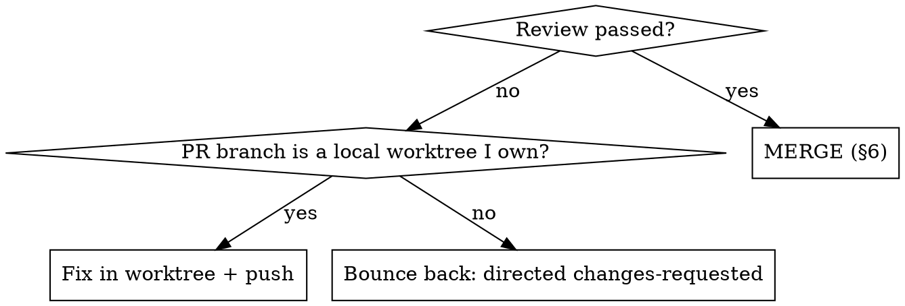

# loop-pr-merge

## Overview

Run a continuous, self-paced loop that **watches a repository for new pull requests and reviews-then-merges each one** against *that repository's own* development and PR-merge rules. Not a generic linter — the bar is "does this PR satisfy the rules the repo itself declares" (CLAUDE.md, sync rules, test discipline, protected-file handling).

The loop's job per PR: recover the project context (the PR's spec + diagnosis), judge it mergeable, review it at a rigor proportional to its risk, and then either **merge it** (clean pass), **fix it in place and push** (when the PR was made on a local worktree you own), or **bounce it back** with a directed changes-requested review (when it's not yours to touch).

This is `/loop` (self-paced dynamic mode) + a `Monitor` on new PRs + a fixed per-PR review-and-act procedure. Slash-invoked: `/loop-pr-merge [repo-path]`.

This skill distills a real session that reviewed-and-merged ~25 consecutive PRs (features, fixes, follow-up fixes, and a DeerFlow sync) on one repo. The patterns below are the ones that actually carried that run; the appendix at the end is a condensed worked log.

## Argument

The argument is the repo to watch (path or `owner/repo`). If omitted, use the current working directory's repo. Resolve it once, `cd` there, and confirm `gh` is authenticated for it (`gh repo view`).

## When to use



Trigger phrases: "babysit PRs", "watch/monitor PRs", "review and merge new PRs in a loop", "盯着这个仓库的 PR", "新 PR 来了就审了合", `/loop-pr-merge`.

## 1. Read the repo's rules first (do this once, before the loop)

The whole point is to enforce *the repo's own* bar. Before reviewing anything:

1. Read `CLAUDE.md` at the repo root in full. Extract the development requirements, the **PR-merge requirements**, and especially the **sync rules** (these are the highest-stakes — see `references/review-rigor.md`).
2. Note any `docs/` the CLAUDE.md points to (agent docs, ADRs, triage labels, domain context).
3. Note the repo's test command and where tests live, the default branch, and any protected-file list (often in a `scripts/sync-*.sh` or similar).

**Completion criterion:** you can state, in one or two sentences, what this repo considers a mergeable PR and what its sync discipline requires.

## 2. Arm the loop

This is dynamic `/loop` mode — you self-pace and a Monitor is the primary wake signal.

1. **Establish the watermark**: find the highest existing PR number so the Monitor only fires on genuinely new PRs. Review any already-open PRs immediately (don't wait for the Monitor).
2. **Arm a persistent Monitor** that emits one line per newly-opened PR above the watermark, e.g. poll `gh pr list --state open --json number,title,author` every ~60s and emit PRs with number > watermark. Set `persistent: true`. Arm it **once** — on later iterations, check it's still running before re-arming.
3. **Confirm to the user** what you're watching, then call `ScheduleWakeup` with a long fallback heartbeat (1200–1800s) — the Monitor wakes you the instant a PR appears; the heartbeat is only a safety net.
4. Each time a `<task-notification>` reports a new PR, handle it (§3–§6), then re-arm `ScheduleWakeup` with the same prompt and heartbeat.

To stop: omit `ScheduleWakeup` and `TaskStop` the Monitor.

## 3. Triage each PR (cheap checks first)

**First, read the environment receipt if the PR has one.** PRs produced by `/implement-spec` carry a `## 环境收据` block in the body (base SHA, venv isolation, config.yaml/live handling, `N passed/M skipped/K failed`). Grep it out first — it lets you skip *exploratory* reruns:

- **Deterministic facts → trust after a 1-second check.** Confirm the receipt's `base` SHA against `gh pr view --json baseRefName,headRefOid`; if they match, take its base-freshness judgement instead of re-deriving it. If `venv` says an isolated `uv sync --frozen`, trust that its green tested the *PR* code (not the main repo via a shared `.pth`) — you don't need to re-stand-up `PYTHONPATH` just to discover that.
- **Self-reported results → narrow your rerun to the neighborhood + a per-failure recheck, don't replace with a blind full-suite rerun.** The receipt's `N passed/K failed` does **not** let you skip verification, but it also does **not** oblige you to re-run the whole suite. It scopes your run to (a) the changed area's **neighborhood** (§4) and (b) re-deriving each of the receipt's **named failures** yourself (is each really the known env false-red it claims, or a real regression mislabeled?). The full suite is the author's + CI's job, not the reviewer's default — reserve it for shared-infra / delete-heavy / suspicious-bucketing PRs (§4).
- **No receipt** (external / old PR): fall back to the full flow below; still prefer neighborhood + CI over a blanket full-suite rerun unless the change is high-risk.

> The receipt is a reconciliation lead, not a merge waiver. Verifiable facts (base / venv / config) you may trust; the passed count narrows your rerun to the neighborhood; the *named failures* you re-derive one by one. **You are not the full-suite oracle — CI and the receipt are** (see §4). Don't do the author's suite-running for them.

For every PR, gather before reading code:

```bash
gh pr view <N> --json number,title,author,baseRefName,headRefName,headRefOid,additions,deletions,changedFiles,body,mergeable,mergeStateStatus
gh pr diff <N> --name-only
gh pr view <N> --json statusCheckRollup --jq '.statusCheckRollup[] | {name:(.name//.context),conclusion:(.conclusion//.state)}'
```

Decide three things:
- **Base freshness.** Is the PR head a descendant of current `origin/dev` (clean), or is the base **stale**? If stale, you must verify against the **3-way merge result**, not the PR branch in isolation. See `references/review-rigor.md#stale-base`. (If the receipt's base SHA checked out, you already have this.)
- **CI.** Green? If `IN_PROGRESS`/pending, **do not sit and wait** — suspend this PR and move on (see below). Never merge on unfinished CI, but never idle on it either. `UNSTABLE` with the only required check green is usually fine (GitHub quirk); confirm via the rollup.
- **Risk tier** (sets how deep §4 goes): docs/prompt-only < single-tool < harness-core (middleware/executor/guardrails/seal) < **sync PR** (highest).

**When CI is unfinished, suspend — don't block:**

1. Record this PR in a **pending-CI list** (PR#, head SHA, which step you'd reached).
2. Arm a Monitor on its checks (non-blocking) — or fold it into the loop's existing Monitor.
3. **Go do work that doesn't depend on CI**: triage/review the next PR, or advance *this* PR's CI-independent steps — read the spec (§3.5), byte-check protected files (§4), run the local rerun aligned to HEAD.
4. When the Monitor reports CI green → return to this PR and finish (§6). CI red → §5 (bounce/fix).

**Completion criterion:** you know whether the merge is clean or stale-base, whether CI is green (or suspended-pending), and the risk tier.

## 3.5. Recover the project context — read the spec before the code

A PR in this workflow is **never a stranger**: every change starts from a spec. Reviewing the diff in a vacuum loses the project-level cause-and-effect and makes review generic instead of targeted. Before reading code, recover the intent:

1. **Find and read the spec.** The PR body usually links `docs/superpowers/specs/<date>-<topic>-spec.md` and often a `docs/problems/<date>-...md` diagnosis; the branch/worktree name typically mirrors the spec slug. Read the spec's action summary, change list (manifest), tests, acceptance criteria, and risk notes.
2. **Read the diagnosis doc** if referenced — it carries the observed failure (dogfood/prod trace) and the root-cause reasoning. This is what lets you judge *does the fix address the root cause, or just a symptom*.
3. **Recover review memory** for this area: prior PRs on the same files, established root causes, retracted hypotheses. A PR that contradicts a settled root cause or re-introduces a fixed bug is a **finding**, not a pass.
4. **Place it in the sequence**: what merged just before? Does it build on a recent PR (verify those pieces survive) or supersede one (verify the old approach is cleanly replaced)?

Then review the diff **against the spec's manifest and acceptance criteria** — did it do everything the spec claimed, and did it quietly do *more* (scope creep)?

This step is the difference between "a stranger PR walked in" and "I know exactly why this change exists and how it fits the project". See `references/review-rigor.md#§0`. (If the PR carried an environment receipt, its base SHA and test result give this step a starting point — recover the spec *around* those facts rather than from zero.)

**Completion criterion:** you can state the PR's root cause, its intended manifest, and how it relates to the last few merges — before judging a single line.

## 4. Review with risk-scaled rigor

Read `references/review-rigor.md` and apply the checks for this PR's risk tier. The non-negotiables for any code PR:

- **Fix targets the root cause, not a symptom.** Judge the diff against the spec's diagnosis (§3.5), not just "does it look reasonable". A locally-plausible fix that misses the real root cause is the most expensive miss.
- **Read the actual diff** — a good PR body still needs the code verified against it.
- **Protected / constitution files** (prompts, registries, sync-protected lists): head-to-head byte verification, not grep. A constraint can be paraphrased away while the grep string still matches.
- **Assembly chain**: a new tool must be wired in *every* required place (definition + export + registry + the agent's allow-list). Verify at runtime, not by grep.
- **Recent-PR survival**: confirm the PR doesn't silently revert or collide with what merged in the last few PRs (especially for stale-base and sync PRs).
- **Import-ring**: after touching harness core, bare-import the production entrypoints; they must load with no cycle.
- **Red→green**: the PR's new tests must fail against pre-change source and pass against the change. For concurrency fixes, prove red across multiple iterations and green under stress.
- **Neighborhood seesaw — NOT the full suite.** The authoritative rerun is the **changed area's test neighborhood** (the changed files' own tests + their direct importers), not the repo's entire suite. Failures must equal the known pre-existing baseline set (compare the failing *file set*, not the count). **You are not the full-suite oracle — CI and the author's environment receipt are.** Reviewers who re-run a 10-minute full suite for every self-authored PR are doing the author's (and CI's) job; that cost, times N PRs, dominates the loop for no added signal. So:
  - **Default (localized change):** run the neighborhood, confirm CI green, and **verify the receipt's claimed failures one by one** — check each *is* what the receipt says (a known env false-red vs. a real regression mislabeled as one). Isolate-and-recheck each named failure under the correct path (prepend the worktree's `packages/kernel`/`packages/ethoinsight` so you test PR code, not the shared-`.pth` main repo — a version-skewed harness/kernel makes a new-signature call `TypeError`→caught→look like a targeted regression). This is minutes, not the whole suite.
  - **Full suite only when justified:** the change touches shared load-bearing infra (dispatcher / parse / kernel / the middleware chain / config), is a delete-heavy refactor, or the receipt's failure *bucketing* looks wrong. Then the whole-suite rerun earns its cost as regression insurance.
  - **Never trust the receipt's conclusion blindly:** a receipt that hand-waves "all N failures are the known kernel false-red" can be bucketing a real regression as noise (seen in practice). The passed-count narrows scope; the *named failures* you re-derive yourself.
  - Red→green, protected-file byte-checks, and the assembly-chain check are **always run in full regardless** — a self-reported count can't stand in for them.
  - ⚠️ Many repos' CI does **not** run the full pytest suite (e.g. only a blocking-IO guard). In that case "full suite green" has no CI oracle and the author's self-report is the only source — which raises the bar for the receipt-failure recheck above, but still does *not* make blanket full-suite reruns the reviewer's default.
- **Three-pathology self-check** (if the repo cares about agent harness quality): reward-hacking / catastrophic-forgetting / under-exploration.

**Track each PR as its own todo list.** A single PR's review is itself a multi-step task (triage → context → rigor → verdict → merge/record). Drive it with TodoWrite so nothing in the rigor checklist gets skipped under the momentum of a long loop — the discipline is what keeps PR #20 reviewed as carefully as PR #1.

Use a temporary detached worktree at the (3-way-merged, if stale) commit to run all verification; never run against the dirty main tree. Clean it up after (`git worktree remove --force` + `prune`).

**Completion criterion:** every claim in the PR body is confirmed against code/tests, or you have a specific finding to act on in §5/§6.

## 5. Act on the verdict



- **Fix-in-worktree path** (the branch exists under the repo's `.claude/worktrees/` and is yours to change): make the minimal fix on that worktree, run the relevant tests green, `git commit` + `git push` to the PR branch, then re-review the updated head. Only fix what the review flagged — no scope creep. Then proceed to §6 if it now passes.
- **Bounce-back path** (not yours / external contributor): post a `changes-requested` review (or comment if self-approval is blocked) that follows the repo's deny-message discipline — **direct, not just informative**: state *what* is wrong, *why* it violates the repo's rules, and *exactly what to change*. Do NOT merge. Leave the PR open for the author.

**Completion criterion:** the PR is either ready to merge, pushed-and-re-reviewed, or has an actionable changes-requested review and is left open.

## 6. Merge + record

On a full pass (auto-merge is the default per this skill's design):

```bash
gh pr merge <N> --squash --delete-branch
```

If GitHub blocks self-approval, post the approving review as a **comment** instead, then merge.

**Then clean up every worktree and branch this PR spawned — both kinds:**

1. **Verification worktrees** you created during review (the `/tmp/pr<N>-check`, `/tmp/pr<N>-base` detached worktrees for the 3-way merge / red-proof):
   ```bash
   git worktree remove --force /tmp/pr<N>-check
   git worktree remove --force /tmp/pr<N>-base    # if you made one for the red proof
   ```
2. **The author's local worktree** — if the PR branch lives on a worktree under the repo's `.claude/worktrees/` (i.e. it was developed locally, the fix-in-worktree case, or any branch you can see in `git worktree list`):
   ```bash
   git worktree remove --force .claude/worktrees/<branch-dir>   # remove the worktree first
   git branch -D <branch>                                        # then the local branch
   ```
   Order matters: a branch that's still checked out in a worktree **cannot** be deleted — `gh pr merge --delete-branch` will fail with "cannot delete branch ... used by worktree". Remove the worktree first, then the branch.
3. **The remote branch** — `--delete-branch` usually handles it; if it didn't (e.g. the local-worktree block above), delete it explicitly:
   ```bash
   gh api -X DELETE repos/<owner>/<repo>/git/refs/heads/<branch>
   ```
4. **Prune** stale worktree metadata and refresh:
   ```bash
   git worktree prune
   git fetch origin && git log origin/<default-branch> --oneline -1
   ```

Finally, **record a short memory note** (what the PR did, what you verified, the merge commit) so later PRs that touch the same area inherit the context — and so you can detect a later PR silently reverting it.

**Completion criterion:** PR is MERGED; *all* verification worktrees removed; the author's local worktree + its local branch removed (if any); the remote branch gone; `git worktree list` is clean; origin refreshed; outcome recorded.

> Also clean up on the **other** exit paths, not just merge:
> - **Bounce-back** (changes-requested, PR left open): remove your `/tmp/pr<N>-*` verification worktrees, but **leave the author's `.claude/worktrees/` worktree and branch alone** — they need it to push the fix.
> - **Fix-in-worktree** (you pushed a fix to a local worktree, then it merged): clean it up as in step 2 above, same as any merged local branch.

## Hard rules (learned the hard way)

- **Read the spec before the diff.** A PR without its project context gets reviewed generically and misses root-cause and collision problems. (§3.5)
- **Read the environment receipt, then trust facts / downgrade results.** A `/implement-spec` PR carries a `## 环境收据` (base SHA, venv isolation, config/live handling, passed count). Trust the *verifiable facts* (base, venv, config) after a 1-second check — they save exploratory reruns. The self-reported passed count only **downgrades** your rerun to the incremental-against-HEAD one; it is never a merge waiver. No receipt ⇒ full flow. (§3)
- **Never merge on unfinished/failing CI — but suspend, don't idle.** CI is an *async gate in a different environment* (worktree-local green can't cover it — different `CI=1` skips, lockfile, lint/build). So it must finish before merge, yet sitting and watching the spinner is wasted: park the PR in a pending-CI list, `Monitor` its checks, and go advance another PR or this PR's CI-independent steps. Come back when it's green. `UNSTABLE` ≠ failing; confirm via the status rollup.
- **Stale base ⇒ verify the merge result, not the PR branch.** Compute it with `git merge-tree --write-tree` → `git commit-tree` → detached worktree. See references.
- **Worktree shares the main venv** (editable `.pth` points at the main repo) ⇒ running plain `pytest` tests *main* code, not the PR. Override `PYTHONPATH` to the worktree's package source (or use the worktree's own venv if it has one). See references.
- **Protected/prompt files: byte-level head-to-head, never grep-only.** Grep passes even when a constraint is paraphrased into uselessness.
- **A new tool isn't usable until it's registered everywhere.** Verify the assembly chain at runtime — export ≠ registered.
- **Don't auto-fix branches you don't own.** Bounce those back with directions.
- **Auto-fix means minimal + in-scope.** Fix exactly what the review flagged; re-review the new head before merging.
- **Clean up worktrees on exit — both kinds.** After merge, remove your `/tmp/pr<N>-*` verification worktrees *and* the author's `.claude/worktrees/` worktree+branch if the PR was local. Remove the worktree **before** deleting its branch (a checked-out branch can't be deleted — that's why `--delete-branch` fails on local-worktree PRs). On a bounce-back, clean only your verification worktrees and leave the author's alone. End with `git worktree prune` and a clean `git worktree list`.
- **Record every merge.** The loop's memory is how you catch a later PR colliding with or reverting an earlier one — and how a follow-up PR's diagnosis tells you what an earlier PR (maybe one *you* merged) actually got wrong.
- **Your own approvals aren't immune.** A PR can pass your review and still have a latent bug a later dogfood surfaces (e.g. unit tests used a capture-runner that hid an unresolved-path bug). When a follow-up PR fixes something you merged, update your memory with the gap your review missed and tighten the relevant check — that self-correction is part of the loop.
- **Self-approval is usually blocked.** If `gh pr review --approve` fails on your own PR, post the review as a **comment** and merge anyway.
- **Backtick-heavy review bodies → use `--body-file`,** not inline `--body` (the shell mangles backticks via command substitution).

## Appendix — condensed worked log (this skill's source session)

A single loop reviewed/merged ~25 PRs on one repo. Representative moves, as concrete precedent:

- **Feature PR (new deterministic tool).** Verified value framing was honest (not hung on a refuted premise), the tool sealed/delivered on **all** paths, the **assembly chain** at runtime (definition+export+registry+allow-list), import-ring, red→green, and a ~400-test neighborhood seesaw. Merged.
- **Seal/middleware-core PR.** Verification triad: import-ring bare-import of the merge source + direct `importlib` assertions on the changed constants/sets + neighborhood seesaw to prove the main path didn't regress. Confirmed a safety invariant (a cognitive-product producer stays *out* of the auto-reconstruct set) was preserved.
- **Concurrency fix.** Proved the race **deterministically**: overlaid the test on the no-lock source and ran it 3× (barrier-aligned) — failed every time; then ran the fixed version 5× under stress — green every time. Single runs would have proven nothing.
- **PR that broke an existing pinned test.** Did **not** auto-merge. Confirmed pristine-dev passed and the PR introduced the red (the PR's self-reported "neighborhood" list had missed the pinned test). Surfaced it; the owner authorized a one-line test fix; re-verified; merged. Lesson: when a PR changes a shared prompt/constant, independently grep *all* its pinned consumers.
- **DeerFlow sync PR (highest stakes).** 3-way merge against current dev; confirmed the just-merged feature survived; head-to-head byte-checked all 6 protected files (the local memory-isolation customization survived **in code**, not just a docstring; upstream's refactor was followed, the local constraint preserved); registry files untouched; import-ring; no new top-level optional-dep import; broad seesaw over both the sync's suites and recent-PR neighborhoods. Merged + bumped sync-state.
- **Follow-up fix to a PR I'd merged.** A dogfood surfaced that the merged tool passed raw `/mnt` virtual paths to in-process scripts (112/113 outputs failed). The fix pre-resolved argv paths. Red→green confirmed; the ethoinsight compute chain (shared helper) stayed green. Recorded the gap my earlier review missed (capture-runner unit tests hid it) and tightened the check.

The throughline: **every PR got the same procedure regardless of how routine it looked**, the rigor scaled with risk, and the loop's memory turned a stream of "stranger PRs" into a coherent project narrative.

## Reference

- `references/review-rigor.md` — the full risk-tiered verification methodology: §0 recover-project-context (spec + diagnosis + memory), stale-base 3-way merge, worktree/venv setup, import-ring, red→green (incl. concurrency), neighborhood seesaw + test-failure triage, sync-PR discipline (protected-file head-to-head, local-customization survival), assembly-chain runtime check + argv path-resolution, and the three-pathology self-check.
