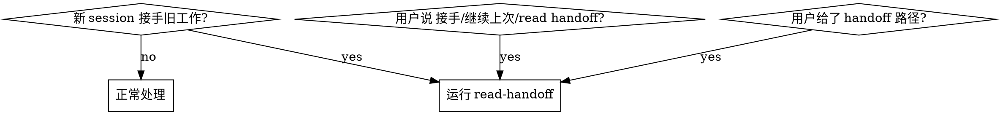

# Read Handoff

## Overview

读取上一个 session 留下的 handoff 文档，**结合 git 最新进展和同期遗留文档交叉核实**，搞清楚本 session 真正该从哪里接手 —— 然后**只汇报理解 + 反问用户**，不擅自动手。

与 `handoff` skill 配对：`handoff` 写、`read-handoff` 读。

**核心立场：handoff 是「写下那一刻」的快照，会过期。** handoff 说的「待做」可能已被其后的 commit 做掉，「已完成」可能被回滚，HEAD 可能早已超过 handoff 描述的状态。所以**读 handoff 后必须用 git 现状校准，再相信它**（用户原则 `feedback-handoff-bug-claims-expire-check-head-before-execution`）。

## When to Use



## Usage

```
/read-handoff {directory: docs/handoffs/2026-06/2026-06-29-xxx-handoff.md}
```

- **传了路径**：读指定那份 handoff。
- **没传**：在 `docs/handoffs/`（递归）找**最新日期**的 `*-handoff.md`；若最近几份难分主次，列出最近 3-5 份让用户选，不擅自猜。

## 执行流程（五步）

### 1. 定位 handoff
- 传了路径 → 读它。
- 没传 → `find docs/handoffs -name '*-handoff.md'`，按文件名日期（`YYYY-MM-DD-` 前缀）取最新；歧义则列出让用户选。

### 2. 读 handoff，提取结构化信息
按 `handoff` skill 的结构提取：**任务目标 / 已完成（✅）/ 关键发现 / 未完成事项（按优先级）/ 第一步建议 / 风险陷阱**。同时记下：
- handoff 的**日期**（文件名 + 正文「现状」里写的 HEAD/commit）。
- handoff 引用的**其它文件**（spec/plan/PR 号/commit hash/具体路径）—— 这些是第 4 步要追的线索。

### 3. 用 git 现状校准（防过期 —— 不可跳）

handoff 里的论断**默认可能过期**，逐项用 git 核：

```bash
git fetch origin <branch> -q                       # 先同步远端视角
git status -sb                                      # 本地 vs 远端：ahead/behind/分叉
git log --oneline -15                               # 最近 commit
git log --oneline --since="<handoff日期>"           # handoff 之后发生了什么
```

逐项判断：
- **HEAD 是否已超过 handoff 描述的状态**：handoff 说「HEAD=abc123」，现在 HEAD 是什么？中间多了哪些 commit？
- **handoff 的每个「未完成项」是否已被做掉**：用后续 commit 的 message / PR 号 / `git log --oneline --grep` 比对（如 handoff 说「待修 X」，后续有没有 `修复 X (#NNN)`）。**已做掉的，标为「✅ 疑似已完成（commit YYYY）」并提示需核实**。
- **本地是否 behind/分叉**：若 behind，提示「下一步通常要先 `git pull --rebase`」（但**不自动执行** —— 改动 git 状态属于动手，留给用户/下一步）。

### 4. 读同期遗留文档（按日期范围）
handoff 常引用 spec/plan。按 **handoff 日期 ± 几天**在常见目录找同期文档并读关键的：
```bash
ls docs/superpowers/specs/ docs/specs/ docs/plans/ 2>/dev/null | grep "<handoff日期前缀>"
```
- 对每份被引用的 spec：**对照 git 判断它是否已被实施**（commit message 提到该 spec 主题 / 改了该 spec 涉及的文件）。
- 区分：**待实施 spec** vs **已实施 spec（handoff 写时还没做、现在做了）**。

### 5. 汇报 + 反问（**只到此为止，不动手**）
产出一份「接手简报」：

1. **handoff 说的现状**（一句话）。
2. **git 校准后的真实现状**：HEAD 进展、本地/远端同步状态、handoff 之后新增的 commit。
3. **逐项核对表**：handoff 的未完成项 → 现在状态（仍待做 / 疑似已完成需核实 / 已过期作废）。
4. **同期 spec 状态**：哪些待实施、哪些已实施。
5. **反问用户**：把「我判断仍待做」和「我判断已完成但需你确认」摊开，问：
   - 哪些其实已经做完了（避免重复劳动）？
   - 接下来从哪一项开始？
   - 若 git 显示 behind/分叉：要不要先 `git pull --rebase`？

**不自动动手**（不改代码、不动 git、不跑实施）。等用户拍板后，若下一步是「实施某 spec」，可引导到 `implement-spec` skill。

## Key Principles

- **handoff 会过期，git 是真相**：先信 git 现状，再信 handoff 文字。任何「待做/已完成」论断都用 commit 核一遍。
- **不重复劳动**：handoff 写后被做掉的事，明确标出，别让用户/下个 agent 重做。
- **只读不写**：本 skill 只读 + 汇报 + 反问；改 git/代码留给用户确认后的下一步。
- **歧义就问**：找不准 handoff、判不准某项是否完成 → 列证据问用户，不猜。
- **具体化**：引用文件路径、commit hash、PR 号、spec 名，不说「相关文档」。

## 与其它 skill 的衔接

- 上游：`handoff`（写出本 skill 要读的文档）。
- 下游：用户确认接手点后，若是实施 spec → `implement-spec`；若要诊断 bug → `diagnose`。
